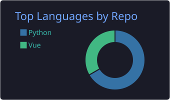
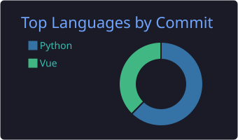

## 🧑‍💻 About Me

- 🏢 Software Engineer at **freee K.K.**
- 🌱 Interested in developer productivity & AI agents

## 🛠️ Tech Stack

## 📊 GitHub Stats

## 🐍 Contribution Snake

<picture>
  <source media="(prefers-color-scheme: dark)" srcset="https://raw.githubusercontent.com/maryuka/maryuka/output/github-contribution-grid-snake-dark.svg" />
  <source media="(prefers-color-scheme: light)" srcset="https://raw.githubusercontent.com/maryuka/maryuka/output/github-contribution-grid-snake.svg" />
  
</picture>

